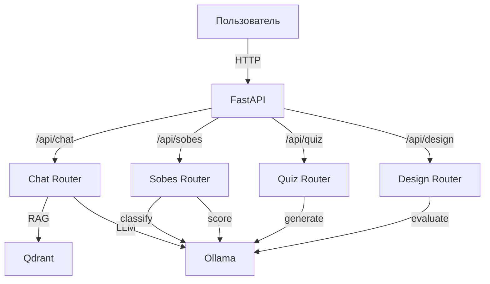

# tech_interview_agent — Vertical Slice Architecture (VSA)

Проект: FastAPI‑приложение «интервью‑ассистент» с RAG (Qdrant) и генерацией ответов через LLM (Ollama).

После миграции проект организован в стиле **Vertical‑Slice Architecture**: каждая фича живёт в своём «слайсе» и содержит всё необходимое (API → Domain → Providers → Infrastructure).

---

## Быстрый старт

### Docker (рекомендуется)

```bash
docker compose up --build
```

Откройте: `http://localhost:8000`

**Настройки через переменные окружения (`.env`):**

| Переменная | По умолчанию | Описание |
|---|---|---|
| `OLLAMA_URL` | `http://host.docker.internal:11434` | URL Ollama |
| `OLLAMA_MODEL` | `qwen2.5:7b` | Модель LLM |
| `OLLAMA_EMBED_MODEL` | `nomic-embed-text` | Модель эмбеддингов |
| `OLLAMA_TIMEOUT_SEC` | `120` | Таймаут Ollama |
| `QDRANT_URL` | `http://qdrant:6333` | URL Qdrant |
| `QDRANT_COLLECTION` | `interview_qa` | Коллекция Qdrant |
| `INTERVIEW_DOCX_PATH` | `/app/app/interview_questions.docx` | Файл вопросов |
| `SYSTEM_PROMPT_PATH` | `/app/prompts/chat/system.md` | Системный промпт |
| `DESIGN_SCENARIOS_PATH` | `/app/prompts/design/scenarios.md` | Сценарии дизайна |

**Если Ollama на хосте** (не в Docker):
```bash
docker compose up
```

Для доступа к Ollama на хосте с MacOS/Windows: Docker Desktop → Settings → Resources → Network → добавьте `host.docker.internal`.

---

### Локальная разработка

```bash
# Установка зависимостей
pip install -e .
pip install pytest

# Запуск
uvicorn app.main:app --reload
```

Откройте:

- `GET /` — фронтенд
- `GET /api/health` — healthcheck
- `POST /api/chat` — чат

```bash
# Тесты
pytest -q
```

---

## Структура проекта

```
tech_interview_agent/
├─ app/
│  ├─ core/
│  │  ├─ config.py          # настройки (Settings)
│  │  ├─ logger.py
│  │  ├─ exceptions.py
│  │  └─ interfaces/         # Protocol: LLM, VectorStore, Embeddings
│  │
│  ├─ features/
│  │  ├─ chat/              # RAG-чат с интервью-ассистентом
│  │  │  ├─ api/router.py
│  │  │  ├─ domain/
│  │  │  │  ├─ services.py      # run_chat, RAG retrieval
│  │  │  │  ├─ docx_repository.py
│  │  │  │  └─ interview_docx.py
│  │  │  ├─ providers/ollama.py
│  │  │  └─ infrastructure/qdrant.py
│  │  │
│  │  ├─ quiz/              # Тестирование с вариантами ответов
│  │  │  ├─ api/router.py
│  │  │  └─ domain/
│  │  │     ├─ services.py
│  │  │     └─ quiz_generator.py
│  │  │
│  │  ├─ sobes/             # Устное собеседование с оценкой
│  │  │  ├─ api/router.py
│  │  │  └─ domain/
│  │  │     ├─ services.py
│  │  │     ├─ classification.py
│  │  │     ├─ scoring.py
│  │  │     └─ selection.py
│  │  │
│  │  └─ design/            # Системный дизайн
│  │     ├─ api/router.py
│  │     └─ domain/
│  │        ├─ services.py
│  │        └─ scenarios.py
│  │
│  └─ main.py               # точка входа, lifespan
│
├─ prompts/                  # промпты для LLM (все в MD)
│  ├─ chat/system.md         # системный промпт чата
│  ├─ quiz/wrong_answers.md  # генерация неправильных ответов
│  ├─ sobes/
│  │  ├─ classification.md   # классификация вопросов
│  │  └─ scoring.md          # оценка ответов
│  └─ design/
│     └─ scenarios.md        # сценарии (frontmatter YAML)
│
├─ static/                  # фронтенд (index.html)
├─ tests/
│  ├─ unit/
│  └─ integration/
├─ docker-compose.yml
└─ Dockerfile
```

---

## Промпты

Все промпты хранятся в `prompts/` в формате Markdown (MD). Каждый промпт принадлежит определённой фиче.

### Структура промптов

```
prompts/
├── chat/
│   └── system.md           # системный промпт для RAG-чата
├── quiz/
│   └── wrong_answers.md   # промпт для генерации неправильных вариантов
├── sobes/
│   ├── classification.md  # промпт для классификации вопросов
│   └── scoring.md         # промпт для оценки ответа кандидата
└── design/
    └── scenarios.yaml     # конфигурация сценариев (YAML, не LLM-промпт)
```

### Редактирование промптов

Промпты — это обычные Markdown-файлы. Для изменения поведения LLM:

- **Системный промпт чата**: `prompts/chat/system.md`
- **Генерация неправильных ответов**: `prompts/quiz/wrong_answers.md`
- **Классификация вопросов**: `prompts/sobes/classification.md`
- **Оценка ответов**: `prompts/sobes/scoring.md`
- **Сценарии дизайна**: `prompts/design/scenarios.yaml` (конфиг, не промпт)

---

## Архитектурная схема



---

## API эндпоинты

### Проверка здоровья
```bash
curl http://localhost:8000/api/health
```

### Чат с ассистентом
```bash
curl -X POST http://localhost:8000/api/chat \
  -H "Content-Type: application/json" \
  -d '{"message": "Что такое GIL?", "session_id": "test"}'
```

### Квиз
```bash
# Старт
curl -X POST http://localhost:8000/api/quiz/start \
  -H "Content-Type: application/json" \
  -d '{"level": "middle"}'

# Ответ
curl -X POST http://localhost:8000/api/quiz/answer \
  -H "Content-Type: application/json" \
  -d '{"session_id": "...", "question_id": "...", "selected_option": 0}'
```

### Собеседование
```bash
# Старт сессии
curl -X POST http://localhost:8000/api/sobes/start \
  -H "Content-Type: application/json" \
  -d '{"level": "middle", "topics": ["python", "db"]}'

# Ответ
curl -X POST http://localhost:8000/api/sobes/answer \
  -H "Content-Type: application/json" \
  -d '{"session_id": "...", "question_id": "...", "user_answer": "..."}'
```

### Системный дизайн
```bash
# Старт
curl -X POST http://localhost:8000/api/design/start \
  -H "Content-Type: application/json" \
  -d '{"level": "middle"}'

# Ответ на шаг
curl -X POST http://localhost:8000/api/design/answer \
  -H "Content-Type: application/json" \
  -d '{"session_id": "...", "step_id": "...", "user_answer": "..."}'
```

---

## FAQ

**Q: Не запускается Ollama или Qdrant?**
- Проверьте, что сервисы доступны по адресам из `.env`.

**Q: Как обновить базу вопросов?**
- Замените `interview_questions.docx` и перезапустите приложение (автоматический ingest).

**Q: Как изменить промпт?**
- Отредактируйте соответствующий файл в `prompts/`.

**Q: Как добавить новый сценарий дизайна?**
- Добавьте новый элемент в массив `scenarios` в `prompts/design/scenarios.md`.

---

## Контакты

- Вопросы и предложения: [ваш email]
- Issues и баги: через GitHub Issues
